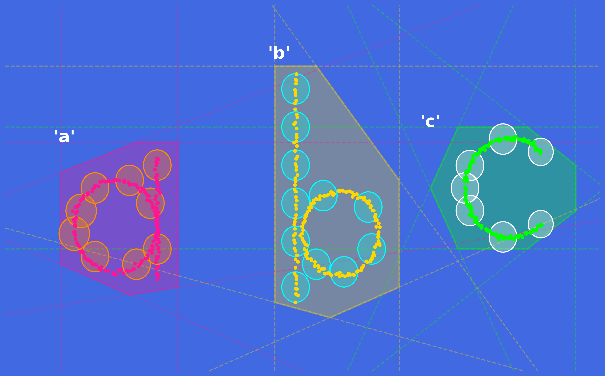

# Beyond Affine Layers: Bounded Ball Coverings to Preclude Gradient Vanishing

[https://zenodo.org/records/23068573](https://zenodo.org/records/23068573)

This repository presents the core implementation of **Bounded Ball Coverings**, an alternative geometric framework designed to transition from traditional unbounded hyperplane partitioning to localized proximity evaluations within hierarchical neural network architectures.

## 1. Problem Formulation

In standard deep learning frameworks, classical linear partitioning relies on unconstrained affine transformations to map feature vectors via hyperplanes. For an input row vector $x_i \in \mathbb{R}^{1 \times m}$ and a corresponding weight column vector $w_j \in \mathbb{R}^{m \times 1}$, the classical linear partition is expressed as:

$$Y_{i,j} = x_i w_j + b_j$$

From a geometric perspective, this strategy partitions the high-dimensional representation space into an infinite number of unbounded polyhedral regions. When modeling complex, non-convex data manifolds, these unconstrained boundaries inevitably engulf large volumes of empty topological cavities and unrelated background space, introducing severe representational redundancy. As a result, traditional frameworks typically require dense structural stacking and deeper layers merely to approximate highly localized boundaries.

## 2. Proposed Bounded Ball Covered Architecture

Instead of partition strategies utilizing unbounded planes, this architecture enforces geometric confinement directly from the outset. We replace traditional affine transformations entirely with solid ball boundaries, shifting the layer mechanics to localized proximity evaluations.

Let $x_i \in \mathbb{R}^{1 \times m}$ (with `x.shape = (m,)`) represent the $i$-th input feature row vector within a batch of size $b$. Let $w_j \in \mathbb{R}^{m \times 1}$ (for $j = 1, 2, \dots, n$) denote the column vector representing the geometric center of the $j$-th multidimensional bounding ball. We define the trainable squared radius vector as $B \in \mathbb{R}^{1 \times n}$, where each scalar component $b_j$ represents the boundary threshold for its respective sphere $C_j$.

At the localized tensor layer, each individual element $(i, j)$ of the output field is evaluated directly through the localized algebraic reduction of two $m$-dimensional spatial vectors:

$$
\mathbb{R}^{1 \times m} \times \mathbb{R}^{m \times 1} \longrightarrow \mathbb{R}^{1 \times 1} \implies b_j - (x_i - w_j^T)(x_i - w_j^T)^T \longrightarrow Y_{i,j}
$$

Because the forward pass maps the critical computational burden onto this parallel inner product routine, the formulation natively leverages highly optimized matrix multiply hardware kernels at the individual core level. 

### Topological Boundary Filtration Analysis

To visually contrast our bounded topology against traditional affine spaces, we examine data distributions generated from non-convex, interleaved data clusters (such as complex manifolds mimicking structural letter trajectories like 'a', 'b', and 'c'):

*Figure: Geometric and topological boundary approximation on non-convex 'a', 'b', and 'c' manifolds. Traditional affine hyperplanes intersect to form bounded polyhedral regions (shaded half-space polygons via infinite dashed lines), which erroneously engulf empty topological cavities (the inner holes) and unrelated background space. Conversely, our proposed framework deploys heterogeneous, variable-radius ball coverings (colored circles) that strictly adapt to the concrete feature boundary, leaving the internal voids perfectly vacant without spatial inflation.*

## 3. Spatial Boundary Filtration and Metric Stability

Traditional deep learning architectures often encounter optimization challenges when handling rapid feature divergence across deep affine layers, which frequently necessitates the integration of auxiliary regularizers such as Batch Normalization (BN). From a geometric perspective, standard normalization heuristics adjust the data distribution based on empirical statistical moments, effectively reshaping the feature space under an assumed Gaussian baseline. While highly effective in flattening numerical variances during feature propagation, this statistical rescaling can inadvertently affect the spatial localization of tight boundary interfaces, as the underlying affine layers remain fundamentally unconstrained and infinite in extent.

In contrast, the proposed Bounded Ball Covered framework shifts the regularization mechanism from statistical post-processing to intrinsic geometric confinement. By defining the layer mechanics around the localized threshold condition of \(Y_{i,j} = 0\), the formulation establishes a well-defined boundary interface that naturally delineates localized spatial domains. Because the representation space is bounded-by-design under the compact solid ball envelopes, the error signals are propagation-stabilized directly through the spatial coordinates of the localized displacement arrays. This regular spatial confinement provides a mathematically consistent alternative for maintaining metric stability, reducing the structural dependence on multi-layer parameter stacking and empirical normalization loops while fully preserving the underlying topological representations.

## 4. Empirical Properties and Derivative Stability

Numerical evaluations on standard categorical benchmarks demonstrate the practical efficiency and robustness of this framework:
* **Topological Cavity Preservation:** Bounded spheres strictly encapsulate the active data coordinates while precisely leaving the topological voids vacant. This regular geometric isolation fundamentally eliminates representational redundancy in empty background spaces.
* **Numerical Convergence Stability:** During backpropagation, the gradients required for parameter optimization are direct linear consequences of the localized spatial displacement arrays. The local derivatives follow standard chain-rule operations applied directly to inner product spaces, eliminating the need for empirical post-hoc smoothing or artificial feature rescaling. This regular spatial confinement inherently prevents gradient saturation across individual tensor components, eliminating the need for post-hoc empirical weight clipping and ensuring deterministic convergence paths.

## 5. Architectural Statement

This mathematical framework is strictly dedicated to pure geometric optimization and algorithmic design. Low-level architectural implementation and hardware-specific array parallelization across diverse hardware specifications remain the exclusive engineering responsibility of hardware manufacturers and chip consortia, completely separate from the algorithm designer. The mechanical optimization of tensor operations across varying GPU hardware configurations remains the definitive engineering responsibility of hardware giants.
